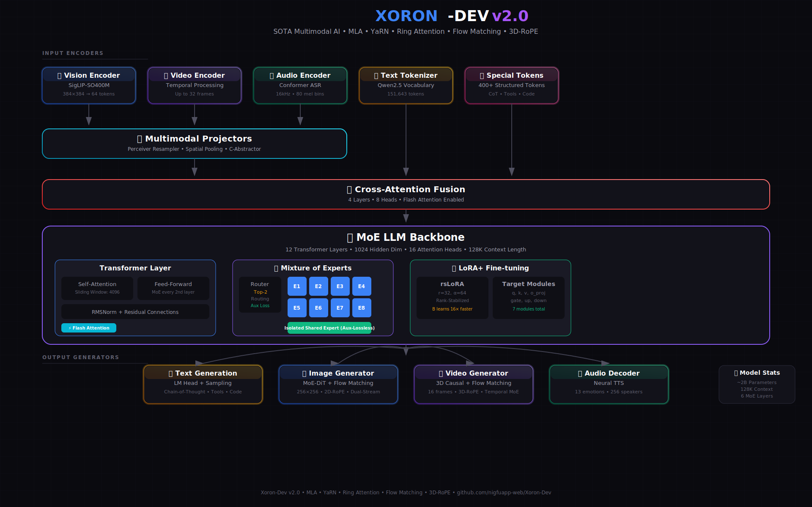
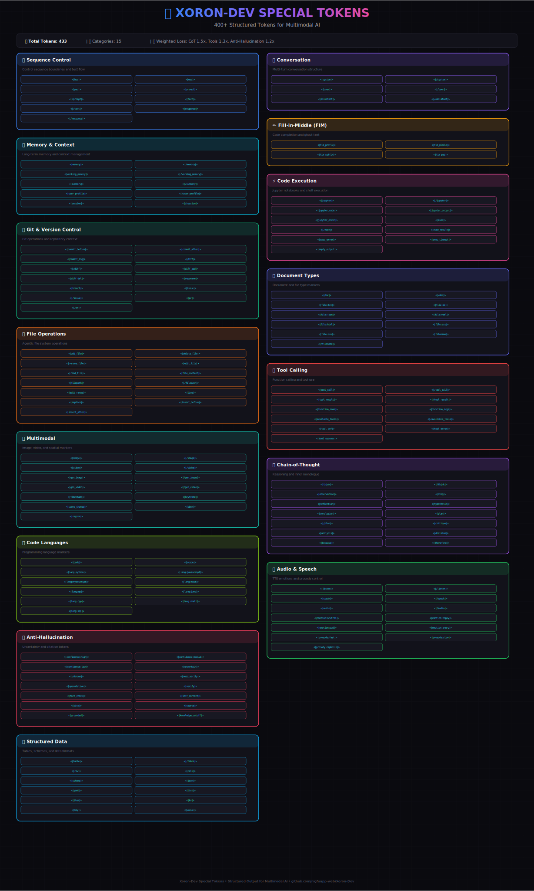
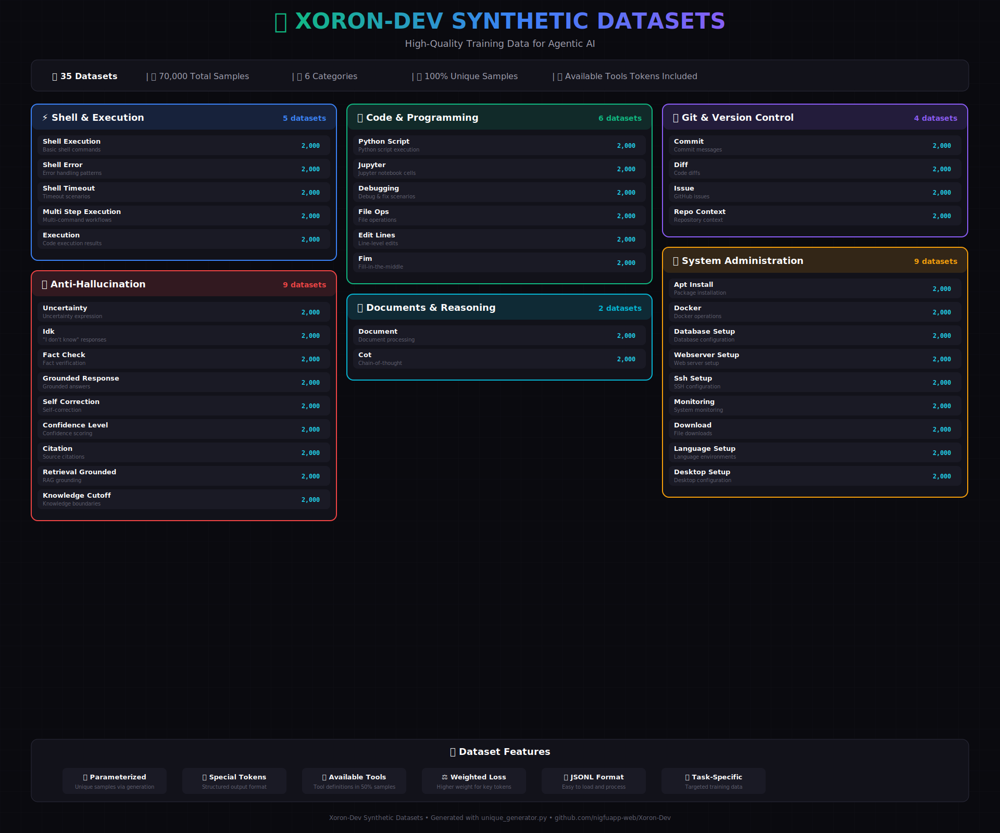

# 🚀 Xoron-Dev: State-of-the-Art Multimodal AI Model

<div align="center">


**A unified multimodal AI model that can understand and generate text, images, video, and audio.**

[Features](#-features) | [Architecture](#%EF%B8%8F-architecture) | [Installation](#-installation) | [Usage](#-usage) | [Training](#%EF%B8%8F-training) | [Export](#-export)

</div>

---

## 🌟 Features

### 🧠 **Multimodal Understanding**
- **Vision**: Image understanding via SigLIP-2 encoder (384x384)
- **Video**: Temporal video understanding with up to 32 frames
- **Audio**: Speech-to-text (ASR) with Conformer encoder
- **Text**: 128K context length with sliding window attention

### 🎨 **Multimodal Generation**
- **Image Generation**: MobileDiffusion with classifier-free guidance
- **Video Generation**: Temporal-aware video diffusion
- **Text-to-Speech**: Neural TTS with emotion and speaker control
- **Text Generation**: MoE-based LLM with chain-of-thought reasoning

### ⚡ **SOTA Training Features**
- **Mixture of Experts (MoE)**: 8 experts with DeepSeek-style shared expert
- **LoRA+**: Efficient fine-tuning with rank-stabilized scaling
- **Flash Attention**: Memory-efficient attention computation
- **Weighted Loss**: Higher weights for reasoning, tool-calling, and anti-hallucination tokens
- **Multi-GPU Support**: Model parallelism for distributed training

### 🛠️ **Agentic Capabilities**
- **Tool Calling**: Function/tool invocation with structured outputs
- **Code Execution**: Shell commands, Python scripts, Jupyter notebooks
- **File Operations**: Create, edit, delete files with special tokens
- **Anti-Hallucination**: Uncertainty expression and citation support

---

## 🏗️ Architecture

### High-Level Overview

```
┌─────────────────────────────────────────────────────────────────────────────┐
│                           XORON-DEV MULTIMODAL MODEL                        │
├─────────────────────────────────────────────────────────────────────────────┤
│                                                                             │
│  ┌─────────────┐  ┌─────────────┐  ┌─────────────┐  ┌─────────────┐        │
│  │   Vision    │  │    Video    │  │    Audio    │  │    Text     │        │
│  │   Encoder   │  │   Encoder   │  │   Encoder   │  │  Tokenizer  │        │
│  │  (SigLIP-2) │  │  (Temporal) │  │ (Conformer) │  │  (Qwen2.5)  │        │
│  └──────┬──────┘  └──────┬──────┘  └──────┬──────┘  └──────┬──────┘        │
│         │                │                │                │               │
│         ▼                ▼                ▼                │               │
│  ┌─────────────────────────────────────────────────┐       │               │
│  │           Multimodal Projectors                 │       │               │
│  │  (Perceiver Resampler / Spatial / C-Abstractor) │       │               │
│  └─────────────────────────┬───────────────────────┘       │               │
│                            │                               │               │
│                            ▼                               ▼               │
│  ┌─────────────────────────────────────────────────────────────────────┐   │
│  │                    Cross-Attention Fusion                           │   │
│  │                    (4 layers, 8 heads)                              │   │
│  └─────────────────────────────┬───────────────────────────────────────┘   │
│                                │                                           │
│                                ▼                                           │
│  ┌─────────────────────────────────────────────────────────────────────┐   │
│  │                     MoE LLM Backbone                                │   │
│  │  ┌─────────────────────────────────────────────────────────────┐   │   │
│  │  │  12 Transformer Layers (1024d, 16 heads)                    │   │   │
│  │  │  ┌─────────────────────────────────────────────────────┐    │   │   │
│  │  │  │  MoE Layer (every 2nd layer)                        │    │   │   │
│  │  │  │  • 8 Routed Experts (top-2 routing)                 │    │   │   │
│  │  │  │  • 1 Shared Expert (DeepSeek-style)                 │    │   │   │
│  │  │  │  • Load Balancing Auxiliary Loss                    │    │   │   │
│  │  │  └─────────────────────────────────────────────────────┘    │   │   │
│  │  │  ┌─────────────────────────────────────────────────────┐    │   │   │
│  │  │  │  Sliding Window Attention (4096 tokens)             │    │   │   │
│  │  │  │  • Efficient 128K context support                   │    │   │   │
│  │  │  │  • Flash Attention enabled                          │    │   │   │
│  │  │  └─────────────────────────────────────────────────────┘    │   │   │
│  │  └─────────────────────────────────────────────────────────────┘   │   │
│  └─────────────────────────────┬───────────────────────────────────────┘   │
│                                │                                           │
│         ┌──────────────────────┼──────────────────────┐                    │
│         ▼                      ▼                      ▼                    │
│  ┌─────────────┐        ┌─────────────┐        ┌─────────────┐            │
│  │    Image    │        │    Video    │        │    Audio    │            │
│  │  Generator  │        │  Generator  │        │   Decoder   │            │
│  │ (Diffusion) │        │ (Diffusion) │        │   (TTS)     │            │
│  └─────────────┘        └─────────────┘        └─────────────┘            │
│                                                                             │
└─────────────────────────────────────────────────────────────────────────────┘
```

### Interactive Demo

<div align="center">

</div>

### Architecture Visualization

<div align="center">

</div>

---

## 📊 Model Configuration

### Default Configuration

| Component | Configuration |
|-----------|--------------|
| **LLM Backbone** | 1024 hidden, 12 layers, 16 heads |
| **Context Length** | 128K tokens (sliding window: 4096) |
| **MoE** | 8 experts, top-2 routing, shared expert |
| **Vision Encoder** | SigLIP-SO400M (384x384) |
| **Video Frames** | Up to 32 frames |
| **Image Generation** | 256x256, 20 inference steps |
| **Video Generation** | 256x256, 16 frames |
| **Audio** | 16kHz, 80 mel bins |
| **Vocabulary** | 151,643 tokens (Qwen2.5) |

### Special Tokens

Xoron-Dev uses an extensive set of **400+ special tokens** for structured outputs:

<div align="center">

</div>

| Category | Tokens |
|----------|--------|
| **Conversation** | `<\|user\|>`, `<\|assistant\|>`, `<\|system\|>` |
| **Reasoning** | `<\|think\|>`, `<\|plan\|>`, `<\|critique\|>`, `<\|analysis\|>` |
| **Tool Calling** | `<\|tool_call\|>`, `<\|tool_result\|>`, `<\|available_tools\|>` |
| **Code Execution** | `<\|exec\|>`, `<\|exec_result\|>`, `<\|jupyter\|>` |
| **File Operations** | `<\|add_file\|>`, `<\|edit_file\|>`, `<\|delete_file\|>` |
| **Anti-Hallucination** | `<\|uncertain\|>`, `<\|cite\|>`, `<\|verify\|>` |
| **Multimodal** | `<\|image\|>`, `<\|video\|>`, `<\|audio\|>` |

---

## 📁 Project Structure

```
Xoron-Dev/
├── 📄 build.py              # Main training script (CLI + interactive)
├── 📄 load.py               # Model loading utilities
├── 📄 setup.py              # Interactive configuration tool
├── 📄 requirements.txt      # Python dependencies
│
├── 📁 config/               # Configuration modules
│   ├── model_config.py      # XoronConfig dataclass
│   ├── training_config.py   # TrainingConfig dataclass
│   ├── dataset_config.py    # Dataset configurations
│   ├── special_tokens.py    # 400+ special tokens
│   └── chat_template.py     # Jinja2 chat templates
│
├── 📁 models/               # Model implementations
│   ├── xoron.py             # Main XoronMultimodalModel
│   ├── 📁 llm/
│   │   └── moe_llama.py     # MoE LLaMA implementation
│   ├── 📁 encoders/
│   │   ├── vision.py        # SigLIP vision encoder
│   │   ├── video.py         # Temporal video encoder
│   │   └── audio.py         # Conformer audio encoder/decoder
│   ├── 📁 generators/
│   │   ├── image.py         # MobileDiffusion image generator
│   │   └── video.py         # Video diffusion generator
│   └── 📁 components/
│       ├── moe.py           # MoE layer with shared expert
│       ├── attention.py     # Flash attention + cross-attention
│       ├── projectors.py    # Multimodal projectors
│       └── lora.py          # LoRA/rsLoRA/DoRA implementations
│
├── 📁 training/             # Training utilities
│   ├── trainer.py           # XoronTrainer with weighted loss
│   └── training_steps.py    # Per-modality training steps
│
├── 📁 data/                 # Data processing
│   └── formatters.py        # Dataset formatters with special tokens
│
├── 📁 synth/                # Synthetic dataset generation
│   ├── unique_generator.py  # Main dataset generator
│   ├── agentic_dataset_generator.py
│   ├── anti_hallucination_generator.py
│   ├── system_admin_generator.py
│   └── 📁 data/             # Generated datasets (34 types)
│
├── 📁 export/               # Model export utilities
│   ├── onnx_export.py       # ONNX export with quantization
│   └── gguf_export.py       # GGUF export for llama.cpp
│
└── 📁 utils/                # Utility modules
    ├── device.py            # Environment detection
    └── logging.py           # Logging utilities
```

---

## 🚀 Installation

### Prerequisites

- Python 3.10+
- CUDA 11.8+ (for GPU training)
- 16GB+ VRAM recommended

### Install Dependencies

```bash
# Clone the repository
git clone https://github.com/nigfuapp-web/Xoron-Dev.git
cd Xoron-Dev

# Install requirements
pip install -r requirements.txt
```

### Requirements

```
torch
torchvision
torchaudio
transformers
datasets
accelerate
sentencepiece
Pillow
timm
opencv-python-headless
soundfile
librosa
safetensors
onnx
onnxruntime
bitsandbytes
optimum
tqdm
numpy
requests
huggingface_hub
jinja2
```

---

## 💻 Usage

### Quick Start

```python
from models.xoron import XoronMultimodalModel
from config import XoronConfig

# Create model
config = XoronConfig()
model = XoronMultimodalModel(config)

# Load from HuggingFace
model = XoronMultimodalModel.from_pretrained("Backup-bdg/Xoron-Dev-MultiMoe")
```

### Interactive Setup

```bash
# Run interactive configuration tool
python setup.py
```

### CLI Training

```bash
# Build and train new model
python build.py --build

# Train on specific modality
python build.py --build --text
python build.py --build --image
python build.py --build --video
python build.py --build --voice

# Load from HuggingFace and train
python build.py --hf --text

# Resume training
python build.py --resume ./checkpoints/latest

# Export to ONNX/GGUF
python build.py --build --onnx --gguf
```

---

## 🏋️ Training

### Training Configuration

```python
from config import TrainingConfig

config = TrainingConfig(
    batch_size=1,
    gradient_accumulation_steps=64,
    learning_rate=2e-4,
    num_epochs=2,
    max_seq_length=1024,
    
    # Loss weights
    llm_loss_weight=1.0,
    cot_loss_weight=1.5,  # Higher for reasoning
    image_diffusion_loss_weight=0.1,
    video_diffusion_loss_weight=0.1,
    
    # LoRA+ settings
    use_lora_plus=True,
    lora_plus_lr_ratio=16.0,
)
```

### Weighted Loss for Token Groups

The trainer applies higher loss weights to important token groups:

| Token Group | Weight | Purpose |
|-------------|--------|---------|
| Chain-of-Thought | 1.5x | Reasoning tokens (`<\|think\|>`, `<\|plan\|>`) |
| Tool Calling | 1.3x | Function calls (`<\|tool_call\|>`, `<\|function_name\|>`) |
| Anti-Hallucination | 1.2x | Uncertainty (`<\|uncertain\|>`, `<\|cite\|>`) |
| Code Execution | 1.2x | Execution (`<\|exec\|>`, `<\|jupyter\|>`) |

### Synthetic Datasets

<div align="center">

</div>

Generate training data with:

```python
from synth import generate_all_datasets

generate_all_datasets('./synth/data', samples_per_type=2000)
```

**35 Dataset Types across 6 Categories:**
- **Shell & Execution**: Shell commands, errors, timeouts, multi-step workflows
- **Code & Programming**: Python scripts, Jupyter notebooks, debugging, file operations
- **Git & Version Control**: Commits, diffs, issues, repository context
- **System Administration**: Docker, databases, web servers, SSH, monitoring
- **Anti-Hallucination**: Uncertainty, fact-checking, citations, self-correction
- **Documents & Reasoning**: Document processing, chain-of-thought

---

## 📦 Export

### ONNX Export

```bash
# Export with 4-bit quantization
python build.py --build --onnx --quant-bits 4
```

```python
from export import export_to_onnx

export_to_onnx(
    model, config, output_dir,
    quantize=True,
    quantize_bits=4
)
```

### GGUF Export

```bash
# Export for llama.cpp
python build.py --build --gguf --gguf-quant q4_k_m
```

```python
from export import export_to_gguf

export_to_gguf(
    model, config, output_dir,
    quant_type='q4_k_m'  # q4_0, q4_k_m, q5_k_m, q8_0, f16
)
```

---

## 🔧 Configuration Reference

### XoronConfig

```python
@dataclass
class XoronConfig:
    # LLM Architecture
    hidden_size: int = 1024
    num_layers: int = 12
    num_heads: int = 16
    intermediate_size: int = 2048
    vocab_size: int = 151643
    max_position_embeddings: int = 131072  # 128K
    
    # Sliding Window
    use_sliding_window: bool = True
    sliding_window: int = 4096
    
    # MoE
    use_moe: bool = True
    num_experts: int = 8
    num_experts_per_tok: int = 2
    moe_layer_freq: int = 2
    use_shared_expert: bool = True  # DeepSeek-style
    
    # Vision
    vision_model_name: str = "google/siglip-so400m-patch14-384"
    num_vision_tokens: int = 64
    max_video_frames: int = 32
    
    # Generation
    enable_generation: bool = True
    generation_image_size: int = 256
    generation_cfg_scale: float = 7.5
    
    # LoRA
    use_lora: bool = True
    lora_r: int = 32
    lora_alpha: int = 64
    use_rslora: bool = True
    
    # Cross-Attention
    use_cross_attention: bool = True
    cross_attention_layers: int = 4
    
    # Flash Attention
    use_flash_attention: bool = True
```

---

## 📈 Performance

### Memory Requirements

| Configuration | VRAM Required |
|--------------|---------------|
| Training (batch=1, grad_accum=64) | ~24GB |
| Inference (FP16) | ~8GB |
| Inference (INT4) | ~4GB |

### Supported Environments

- ✅ Local GPU (NVIDIA)
- ✅ Google Colab
- ✅ Kaggle Notebooks
- ✅ Lightning.ai
- ✅ Multi-GPU (Model Parallelism)

---

## 🤝 Contributing

Contributions are welcome! Please feel free to submit a Pull Request.

---

## 📄 License

This project is licensed under the MIT License - see the [LICENSE](LICENSE) file for details.

---

## 🙏 Acknowledgments

- [Hugging Face Transformers](https://github.com/huggingface/transformers)
- [SigLIP](https://github.com/google-research/big_vision)
- [DeepSeek MoE](https://github.com/deepseek-ai/DeepSeek-MoE)
- [Flash Attention](https://github.com/Dao-AILab/flash-attention)

---

<div align="center">

**Built with ❤️ for the AI community**

</div>
